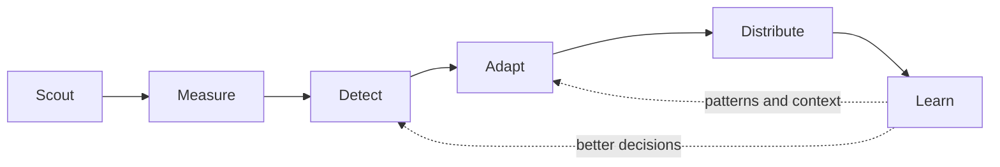

# Vanda — product vision and growth loop

This document defines the product Vanda is intended to become, the primitives its
backend must expose, and the smallest credible path from the current pipeline to
that product.

`docs/pipeline.md` describes the pipeline that exists today. This document is the
product and architecture direction. Where the two differ, this document explains
what should change rather than claiming that the target system is already built.

---

## 1. Product thesis

Vanda is a closed-loop social growth system.

It continuously studies a business's market, identifies content receiving unusual
attention, adapts the underlying opportunity to the business's identity, publishes
through an appropriate authorized channel, measures the result, and retains the
patterns that repeatedly work.

In one sentence:

> Watch a market → detect abnormal performance → adapt the opportunity to the
> brand → distribute it → measure the result → retain what worked.

A representative instruction to Vanda is:

> Find 10 emerging Instagram accounts in my category, each with fewer than 1,000
> followers. Monitor every video they publish. When a post crosses a view threshold
> or begins accelerating unusually quickly, extract why it works, create a
> meaningfully transformed version in my authorized style, publish it through the
> most relevant authorized channel, compare both versions, and retain the patterns
> that prove useful.

The user's desired outcome is not “more AI-generated content.” It is measurable
business growth: attention, followers, engagement, qualified conversations, and
ultimately revenue where attribution is possible.

---

## 2. What the product must make visible

Vanda should feel like a growth loop running on the user's behalf, not a sequence
of AI prompts or abstract backend stages.

The primary product surface should answer:

1. **What is Vanda watching?**
2. **What is gaining unusual traction?**
3. **Why does Vanda believe it is working?**
4. **What is Vanda creating from that insight?**
5. **Where will it be published, and why?**
6. **What happened after publication?**
7. **What did Vanda learn?**

A concise status view might show:

- **Watching:** 10 creators, 34 active posts
- **Breaking out:** 3 unusual posts
- **In production:** 2 adaptations
- **Published:** 5 this week
- **Growth:** views, followers, engagement, conversations, and attributable leads
- **Learned:** 3 patterns that have repeatedly outperformed the account baseline

Every opportunity should expose one inspectable provenance chain:

```text
source post
→ metric evidence
→ reason it was flagged
→ creative analysis
→ adaptation
→ selected channel
→ publication
→ measured result
→ retained learning
```

Activity is not success. The UI may narrate what Vanda is doing, but the hierarchy
must always place outcomes above agent motion, token usage, or content volume.

---

## 3. The target loop

The primary loop is:



| Stage          | Responsibility                                                                             | Primary output                            |
| -------------- | ------------------------------------------------------------------------------------------ | ----------------------------------------- |
| **Scout**      | Maintain a relevant set of creators, channels, and newly published posts                   | monitored creators and source posts       |
| **Measure**    | Capture performance snapshots over the lifetime of each post and account                   | immutable metric snapshots                |
| **Detect**     | Find posts performing unusually well for their age, creator size, and baseline             | ranked opportunities                      |
| **Adapt**      | Understand the creative mechanism and produce a meaningfully transformed, on-brand version | analysis, script, and rendered adaptation |
| **Distribute** | Select an authorized channel, obtain required approval, publish, and verify delivery       | publication                               |
| **Learn**      | Compare source and adapted performance and update evidence-backed patterns                 | outcomes and pattern evidence             |

This is different from a generic content calendar. The system begins with observed
market performance and closes the loop with measured results.

### 3.1 Event-driven, not one immortal process

“Continuous” describes the product behavior, not the lifetime of a model session.
The loop should be implemented as durable, bounded runs triggered by events:

- a creator is added;
- a new source post is found;
- a metric snapshot is due;
- a post crosses a breakout rule;
- an analysis or render completes;
- an approval is granted;
- a scheduled publication becomes due;
- a result reaches a learning checkpoint.

Convex stores the durable state. Crons, webhooks, scheduled functions, and workflows
advance it. Model invocations are episodic and may be safely retried from persisted
inputs.

---

## 4. Architectural decomposition

Vanda consists of three cooperating planes. Keeping them separate prevents the
model from becoming an unreliable scheduler, database, analytics engine, or access
control system.

### 4.1 Data plane

The data plane records external reality and Vanda's durable state.

It is responsible for:

- monitored creators and their account metadata;
- source posts and media metadata;
- immutable metric snapshots;
- authorized channels and media assets;
- opportunity state;
- generated adaptations;
- publication status;
- performance outcomes;
- pattern evidence and provenance.

Convex should remain the primary substrate because it already provides durable
state, scheduled work, workflows, and reactive queries for the UI.

### 4.2 Intelligence plane

Models should be used where semantic judgment is valuable:

- interpreting the source video's central idea;
- extracting the hook, script, structure, pacing, and visual concept;
- distinguishing a reusable mechanism from creator-specific expression;
- creating a meaningfully transformed script;
- applying the user's brand voice, restrictions, offers, and assets;
- recommending a channel from a bounded authorized set;
- explaining an opportunity in language the user can inspect;
- proposing reusable patterns after outcomes are available.

Models should not be responsible for:

- polling APIs;
- deduplicating posts;
- storing memory only in conversation history;
- calculating view velocity or acceleration;
- enforcing authorization or consent;
- deciding whether an API publication technically succeeded;
- inventing unavailable metrics;
- silently bypassing an approval requirement.

### 4.3 Execution plane

Durable workflows perform mechanical and side-effecting work:

- fetch and normalize source media;
- transcribe audio;
- produce analysis inputs;
- synthesize authorized voice or visual assets;
- render a video from a script and creative specification;
- run similarity and policy checks;
- request and await approval;
- publish to a selected channel;
- poll platform processing status;
- collect subsequent metrics.

Every step with an external side effect must be idempotent or guarded by an
idempotency key.

---

## 5. Core domain primitives

The backend should expose product-level primitives rather than force an agent to
manipulate low-level pipeline tables directly.

### 5.1 `monitoredCreators`

A creator or business Vanda is explicitly authorized to observe through available
platform data.

Important fields:

```text
accountId
platform
externalCreatorId
handle
displayName
category
profileUrl
followerCount
status                 active | paused | unavailable
source                 manual | discovered | imported
lastObservedAt
createdAt
updatedAt
```

Follower count is time-varying. The row may cache the latest value, but historical
values belong in metric snapshots.

### 5.2 `sourcePosts`

A post published by a monitored creator.

```text
accountId
monitoredCreatorId
platform
externalPostId
permalink
mediaType
caption
publishedAt
mediaUrl / storageId   when collection and retention are permitted
thumbnailUrl
transcript
observedAt
status                 monitoring | unavailable | archived
```

The source post is immutable identity and provenance. Analysis and measurements
should reference it rather than duplicate its fields.

### 5.3 `metricSnapshots`

An append-only measurement of a creator, source post, or Vanda publication at a
specific time.

```text
accountId
subjectType            creator | source_post | publication
subjectId
observedAt
followers
views
likes
comments
shares
saves
reach
impressions
rawMetrics             optional provider-specific payload
provider
```

Missing data must remain missing. An unavailable metric must not be converted to
zero.

Snapshots make it possible to calculate velocity, acceleration, baselines, and
before/after growth without trusting a mutable “latest metrics” row.

### 5.4 `opportunities`

The central unit of work presented to the user and to an agent.

```text
accountId
sourcePostId
status
score
reason
triggerType            absolute_threshold | velocity | acceleration | relative_outlier
triggeredAt
triggerSnapshotId
creatorBaseline
categoryBaseline
analysisId
assignedChannelId
requiresApproval
createdAt
updatedAt
```

Suggested lifecycle:

```text
detected
→ analyzing
→ ready
→ adapting
→ awaiting_approval
→ approved
→ rendering
→ rendered
→ scheduled
→ published
→ measuring
→ learned
```

Terminal or exceptional states should include:

```text
dismissed | rejected | failed | expired
```

A failure should record its stage and error without erasing prior work.

### 5.5 `creativeAnalyses`

A structured interpretation of why a source post may be working.

```text
sourcePostId
coreIdea
hook
hookType
scriptSummary
scriptBeats[]
structure
pacing
visualConcept
shotPattern
textTreatment
audioRole
callToAction
audiencePromise
novelty
reusableMechanisms[]
creatorSpecificElements[]
confidence
modelRunId
createdAt
```

This is analysis, not permission to copy. Creator-specific expression should be
identified so it can be excluded from the adaptation.

### 5.6 `adaptations`

A transformed creative artifact grounded in an opportunity and the user's brand.

```text
accountId
opportunityId
analysisId
status
concept
hook
script
scenePlan[]
visualDirection
caption
assetIds[]
renderedMediaId
transformationNotes
similarityReview
createdAt
updatedAt
```

`transformationNotes` should explain what mechanism was retained and what expression
was changed. The source permalink must remain available internally for provenance.

### 5.7 `channels`

An authorized destination in the user's distribution network.

```text
accountId
platform
externalChannelId
handle
audienceDescription
categories[]
followerCount
permissions[]
status
publishingPolicy
```

Channel selection is bounded ranking over authorized channels, not a model inventing
a destination. The recommendation should include its rationale and confidence.

### 5.8 `publications`

A specific adaptation published or scheduled on a specific channel.

```text
accountId
adaptationId
channelId
scheduledFor
status                 scheduled | publishing | published | failed
externalPostId
permalink
publishedAt
lastError
idempotencyKey
createdAt
updatedAt
```

A single adaptation may have multiple publications if it is intentionally adapted
again for different channels. Channel-specific variants should be explicit rather
than hidden mutations of the same script.

### 5.9 `patterns` and `patternEvidence`

The pattern library stores reusable hypotheses backed by outcomes.

A pattern might be:

> A concrete contradiction in the first spoken sentence followed by visual proof
> within two seconds performs well for local service businesses.

It should not be merely an LLM-generated tip.

```text
patterns:
  accountId
  name
  description
  scope
  status                 candidate | supported | disproven | retired
  confidence
  createdAt
  updatedAt

patternEvidence:
  patternId
  subjectType            source_post | publication
  subjectId
  outcomeWindow
  baseline
  observedResult
  lift
  supports
  createdAt
```

Confidence should change from accumulated evidence. A single successful post creates
a candidate, not a universal rule.

### 5.10 `authorizedAssets`

Face, voice, footage, logos, product media, and templates available for creation.

```text
accountId
kind                    face | voice | footage | image | logo | template | audio
storageId / providerId
owner
usageScope
consentRecordedAt
expiresAt
status
metadata
```

Every generated publication must be traceable to authorized assets and their usage
scope.

---

## 6. Breakout detection

Breakout detection is an analytics problem first and a language problem second.
Models may explain a breakout, but deterministic code should detect it.

For each post, derive at least:

```text
postAge
viewRate                  views / creator followers
viewVelocity              change in views / elapsed hours
viewAcceleration          change in view velocity
engagementRate
performanceVsCreator      result vs this creator's posts at the same age
performanceVsCategory     result vs comparable creators/posts at the same age
```

Possible triggers include:

1. **Absolute threshold** — views exceed a configured number.
2. **Audience-normalized threshold** — views are unusually high relative to the
   creator's follower count.
3. **Velocity threshold** — new views per hour exceed the creator baseline by a
   configured multiplier.
4. **Acceleration threshold** — view velocity is increasing rapidly across recent
   snapshots.
5. **Relative outlier** — performance at the current post age is statistically
   unusual compared with the creator or category baseline.

A simplified first implementation can use:

```text
isBreakout =
  views >= absoluteViewThreshold
  OR viewVelocity >= creatorMedianVelocityAtSameAge * velocityMultiplier
  OR viewRate >= creatorMedianViewRateAtSameAge * viewRateMultiplier
```

The production score should account for:

- sparse histories for new creators;
- small denominators for very small accounts;
- delayed platform metrics;
- deleted or unavailable posts;
- boosted/paid distribution where it can be identified;
- the fact that metrics from different providers may not be equivalent.

Every opportunity must retain the exact snapshots and rule version that caused it
to be flagged. Recalculation should not erase the original decision evidence.

---

## 7. The agent boundary

The product should provide a narrow set of typed tools that can be used by Vanda's
built-in agent and, later, by user-supplied agents.

Candidate tools:

```text
listMonitoredCreators()
addMonitoredCreator()
listBreakoutOpportunities()
getOpportunity()
getMetricHistory()
analyzeSourcePost()
getBrandContext()
searchPatternLibrary()
createAdaptation()
reviewTransformation()
listAuthorizedChannels()
recommendChannel()
renderAdaptation()
requestApproval()
schedulePublication()
publishAdaptation()
getPerformanceComparison()
recordPatternEvidence()
getGrowthReport()
```

Tools should enforce account scope, authorization, state transitions, and
idempotency. Prompt instructions are not a security boundary.

A typical bounded agent run is:

1. Receive an event that an opportunity is ready.
2. Inspect its source, measurements, and analysis.
3. Retrieve brand context and relevant proven patterns.
4. Decide whether to dismiss, request input, or adapt.
5. Produce an adaptation.
6. Recommend an authorized channel.
7. Request approval when required.
8. Exit after durable work has been recorded.

The agent does not need to stay alive while awaiting metrics or approval. A later
event starts a new run with the current persisted state.

### 7.1 Harness decision

Vanda does not need Eve, Flue, or an embedded Pi harness for the MVP.

Those systems can provide durable sessions, sandboxes, subagents, multi-channel
interaction, and generalized tool execution. They do not solve the product's
primary risks: competitor data access, metric collection, breakout scoring, video
rendering, permissions, publishing, and outcome measurement.

The current Convex substrate and `@convex-dev/workflow` are sufficient for the
first complete vertical slice. A generalized harness can be introduced later if:

- users can install or supply their own agents;
- tasks require sandboxed filesystem or code execution;
- long, open-ended investigations become common;
- subagent delegation demonstrates measurable product value;
- the domain tool API has stabilized enough to expose safely.

Designing stable tools now preserves that option without paying the operational and
conceptual cost today.

---

## 8. Relationship to the existing pipeline

The existing conceptual pipeline is:

```text
Observe → Consolidate → Plan → Create → Publish
```

It currently centers on:

```text
comments and mentions → beliefs and themes → suggestions → posts
```

That work is not wasted. Useful existing pieces include:

- Convex as the reactive state substrate;
- Instagram account connection and token handling;
- webhook and cron infrastructure;
- durable create workflows;
- brand canon and retrieval;
- account autonomy modes and per-item approval;
- model run telemetry;
- suggestion provenance concepts;
- publishing lifecycle and error recording;
- Effect service boundaries and testable pure logic.

However, the existing belief pipeline should become supporting context rather than
the gate through which every opportunity must pass.

A breakout post is direct performance evidence. It may immediately create an
`opportunity`; it does not need to become a belief, accumulate supporting comments,
cross a confidence threshold, and wait for daily planning.

Long-term memory still matters for:

- what the audience repeatedly responds to;
- brand and product facts;
- restrictions and owner corrections;
- category and competitor understanding;
- accumulated pattern evidence;
- recurring comment and sentiment themes.

### 8.1 Current gaps relative to this vision

The current implementation does not yet provide the core target loop:

- `instagramPosts` is scoped to the user's connected Instagram account rather than
  a set of monitored creators;
- likes and comments are mutable fields rather than append-only metric history;
- view velocity and acceleration are not represented;
- `competitors` exists as a signal source literal but has no production observation
  adapter;
- source media, transcripts, and structured creative analyses are not first-class;
- original and adapted posts have no explicit relationship;
- authorized channel networks and channel selection are not modeled;
- the pattern library and outcome evidence are not modeled;
- post composition is currently image-oriented and real video generation is not
  implemented;
- daily planning and hourly creation do not react directly to a breakout event.

The system is therefore close in infrastructure but not yet close to proving the
product promise.

---

## 9. MVP vertical slice

The MVP should prove one complete loop before attempting broad autonomy.

### 9.1 In scope

1. A user connects one owned professional Instagram account.
2. The user manually supplies up to 10 relevant creator handles.
3. Vanda detects new videos from those creators where platform access permits.
4. Vanda records metric snapshots on a defined schedule.
5. Deterministic rules flag unusual traction.
6. Vanda transcribes and creates a structured creative analysis.
7. Vanda produces a meaningfully transformed script in the user's brand voice.
8. The user reviews and approves the adaptation.
9. Vanda renders through one constrained, reliable video template or produces a
   complete export package for manual finalization.
10. Vanda publishes to one owned channel where API access permits.
11. Vanda tracks source and adapted performance.
12. Vanda produces a daily growth report and creates candidate patterns from
    successful outcomes.

### 9.2 Explicitly deferred

- automatic category-wide creator discovery;
- a 10M+ follower multi-channel optimizer;
- fully autonomous publishing by default;
- arbitrary user-provided agents;
- multi-agent orchestration;
- unconstrained video generation;
- broad cross-platform support;
- causal claims that cannot be supported by the available data;
- automatic promotion of one winning post into a universal pattern.

### 9.3 MVP success criteria

The vertical slice is credible when Vanda can repeatedly demonstrate:

- new source videos are detected within the stated observation window;
- metric snapshots are complete enough to detect a breakout;
- the same input snapshots produce the same breakout decision;
- a flagged source can be transformed into an inspectable draft;
- no draft publishes without the configured approval and permissions;
- publication is idempotent and externally verified;
- source and adapted metrics remain comparable and traceable;
- the user can identify what Vanda did and why from the UI;
- the growth report distinguishes measured outcomes from estimates.

---

## 10. Data-access feasibility gate

The largest near-term product risk is platform data access, not model capability or
agent orchestration.

Instagram APIs should not be assumed to provide all of the following:

- discovery of arbitrary accounts by category;
- reliable discovery of accounts below a follower threshold;
- every newly published video from every account type;
- all desired public performance metrics for third-party posts;
- sufficiently frequent updates for accurate acceleration detection;
- durable access to source media for transcription and analysis.

Business Discovery can work with known eligible professional-account usernames,
but that does not by itself prove category discovery or complete competitor
telemetry. API capabilities, app review requirements, account eligibility, metric
definitions, and retention rules can change.

Before expanding the architecture, run a focused feasibility spike:

> Given 10 known professional Instagram handles, can Vanda reliably detect each new
> Reel and collect enough permitted measurements over 48 hours to rank their
> traction?

The spike must record:

- which account types are observable;
- which post fields and metrics are available;
- freshness and delay for each metric;
- rate limits;
- authentication and app-review requirements;
- behavior for deleted, private, age-gated, or converted accounts;
- whether views are public, owner-only, delayed, or unavailable;
- whether media may be retained and processed;
- provider terms and operational cost.

If the official API cannot support the loop, choose explicitly among:

1. manually curated inputs with reduced metrics;
2. a compliant third-party data provider;
3. user-provided source links;
4. a product promise narrowed to data that can be obtained reliably.

No agent framework compensates for unavailable or impermissibly acquired data.

---

## 11. Transformation, consent, and provenance

Vanda should adapt mechanisms, not reproduce protected expression.

For each source-derived adaptation:

- retain the source permalink internally;
- separate the general idea and creative mechanism from creator-specific wording,
  footage, identity, and performance;
- generate a new script rather than lightly paraphrasing line by line;
- avoid reusing source media unless the user has explicit rights;
- use only recorded, authorized face, voice, and media assets;
- preserve transformation notes and model-run provenance;
- support human review before publication;
- perform a similarity review before rendering or publishing;
- allow the owner to block creators, subjects, or transformation types.

A pattern library should store abstractions such as hook types, pacing structures,
and audience promises. It should not become an archive for replaying another
creator's scripts.

---

## 12. Measurement and growth reporting

Vanda should report outcomes at several levels.

### 12.1 Operational health

- monitored creators available/unavailable;
- new posts detected;
- snapshot freshness;
- opportunities detected;
- analyses, renders, and publications failed;
- approvals waiting;
- provider or permission degradation.

### 12.2 Content performance

- views and view velocity;
- reach, likes, comments, shares, and saves where available;
- follower-normalized performance;
- performance versus the channel baseline at the same post age;
- source versus adaptation trajectory;
- retained attention or completion metrics where available.

### 12.3 Account growth

- follower change;
- profile visits and qualified conversations where available;
- leads or conversions when an integration provides attribution;
- performance by theme, hook, format, channel, and pattern;
- percentage of published adaptations beating the account baseline.

Vanda must distinguish:

- **observed facts** — directly returned by a platform or integration;
- **derived metrics** — calculated from observed facts;
- **estimates** — modeled or incomplete values;
- **attribution claims** — supported only when a defensible connection exists.

A rise in followers after a publication is a correlation unless stronger
attribution data is available.

---

## 13. Product and engineering principles

1. **Growth over activity.** Optimize for outcomes, not content count or agent
   motion.
2. **Deterministic detection, semantic interpretation.** Code finds unusual
   performance; models explain and adapt it.
3. **Durable state over conversational memory.** Convex is the source of truth.
4. **Bounded agents over immortal agents.** Start runs from events and persist every
   consequential decision.
5. **Tools are the product API.** The built-in agent and future external agents use
   the same account-scoped primitives.
6. **Provenance everywhere.** A user can trace every adaptation and learning to its
   evidence.
7. **Authorization is explicit.** Channels and assets are usable only within their
   recorded scope.
8. **Human control is per item.** Approval requirements attach to opportunities,
   adaptations, and publications rather than blocking an entire pipeline.
9. **Missing is not zero.** Preserve uncertainty and provider limitations.
10. **Learn from results, not model confidence.** Patterns strengthen through
    measured evidence.
11. **One proven loop before generalized autonomy.** Do not add orchestration until
    the vertical slice works.
12. **Inspectability over magic.** The user should understand what happened, why,
    and what Vanda will do next.

---

## 14. Recommended implementation order

### Phase 0 — prove data access

Run the 10-account, 48-hour feasibility spike. Do not build generalized agent
infrastructure before this is answered.

### Phase 1 — build the market telemetry foundation

Add monitored creators, source posts, and immutable metric snapshots. Implement
new-post detection, snapshot scheduling, provider telemetry, and a basic monitoring
UI.

### Phase 2 — detect opportunities

Implement versioned breakout rules, creator baselines, opportunity lifecycle, and
an inspectable explanation backed by exact metric snapshots.

### Phase 3 — analyze and adapt

Add transcription, structured creative analysis, brand-grounded script generation,
transformation review, and per-item approval.

### Phase 4 — render and publish one reliable format

Use authorized assets and one constrained rendering path. Publish idempotently to
one owned channel and verify the external result.

### Phase 5 — measure and learn

Track post-publication snapshots, compare against appropriate baselines, produce the
growth report, and add evidence-backed candidate patterns.

### Phase 6 — broaden only from demonstrated demand

Consider automatic discovery, more channels, richer rendering, increased autonomy,
and a generalized agent harness only after the core loop produces reliable value.

---

## 15. Final direction

Vanda should not be designed as a model continuously thinking about social media.
It should be designed as a durable growth system that gives models excellent,
well-scoped tools at the moments where reasoning is useful.

The current infrastructure is a meaningful foundation, but the product's center of
gravity must move from belief-driven content planning to performance-driven
opportunity detection and learning:

```text
Current emphasis:
comments → beliefs → suggestions → posts

Target emphasis:
market posts → metric trajectories → opportunities → adaptations → outcomes
```

Keep Convex, durable workflows, brand context, approval controls, model telemetry,
and publishing boundaries. Add the missing market telemetry and opportunity model.
Prove one complete loop before adopting a generalized harness.

That loop—not the agent framework—is Vanda's product.
