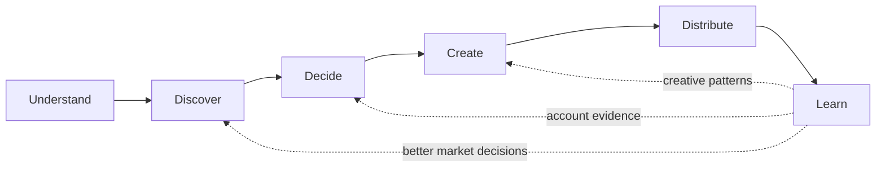

# Vanda — product vision and growth loop

This document defines the product Vanda is intended to become, the primitives its
backend must expose, and the smallest credible path from the current pipeline to
that product.

`docs/pipeline.md` describes the pipeline that exists today. This document is the
product and architecture direction. Where the two differ, this document explains
what should change rather than claiming that the target system is already built.

---

## 1. Product thesis

Vanda is a closed-loop social growth system.

It continuously studies a business's market, identifies content receiving unusual
attention, adapts the underlying opportunity to the business's identity, publishes
through an appropriate authorized channel, measures the result, and retains the
patterns that repeatedly work.

In one sentence:

> Watch a market → detect abnormal performance → adapt the opportunity to the
> brand → distribute it → measure the result → retain what worked.

A representative instruction to Vanda is:

> Find 10 emerging Instagram accounts in my category, each with fewer than 1,000
> followers. Monitor every video they publish. When a post crosses a view threshold
> or begins accelerating unusually quickly, extract why it works, create a
> meaningfully transformed version in my authorized style, publish it through the
> most relevant authorized channel, compare both versions, and retain the patterns
> that prove useful.

The user's desired outcome is not “more AI-generated content.” It is measurable
business growth: attention, followers, engagement, qualified conversations, and
ultimately revenue where attribution is possible.

---

## 2. What the product must make visible

Vanda should feel like a growth loop running on the user's behalf, not a sequence
of AI prompts or abstract backend stages.

The primary product surface should answer:

1. **What is Vanda watching?**
2. **What is gaining unusual traction?**
3. **Why does Vanda believe it is working?**
4. **What is Vanda creating from that insight?**
5. **Where will it be published, and why?**
6. **What happened after publication?**
7. **What did Vanda learn?**

A concise status view might show:

- **Watching:** 10 creators, 34 active posts
- **Breaking out:** 3 unusual posts
- **In production:** 2 adaptations
- **Published:** 5 this week
- **Growth:** views, followers, engagement, conversations, and attributable leads
- **Learned:** 3 patterns that have repeatedly outperformed the account baseline

Every opportunity should expose one inspectable provenance chain:

```text
source post
→ metric evidence
→ reason it was flagged
→ creative analysis
→ selected creative brief
→ rendered artifact
→ selected channel
→ publication
→ measured result
→ retained learning
```

Activity is not success. The UI may narrate what Vanda is doing, but the hierarchy
must always place outcomes above agent motion, token usage, or content volume.

---

## 3. The target loop

The primary loop is:



| Stage          | Responsibility                                                                      | Primary output                                |
| -------------- | ----------------------------------------------------------------------------------- | --------------------------------------------- |
| **Understand** | Maintain confirmed brand context, constraints, channels, and authorized assets      | brand model and authorization envelope        |
| **Discover**   | Scout creators, measure posts, and deterministically detect unusual performance     | monitored market and ranked opportunities     |
| **Decide**     | Explain the transferable mechanism and select an original, brand-relevant direction | creative analysis and production-ready brief  |
| **Create**     | Produce and validate the complete artifact and publication package                  | rendered media, caption, and editorial review |
| **Distribute** | Obtain required approval, publish to an authorized channel, and verify delivery     | externally verified publication               |
| **Learn**      | Compare results with appropriate baselines and update evidence-backed patterns      | outcomes, evidence, and better future inputs  |

The Discover stage contains the mechanical subloop `Scout → Measure → Detect`. The
Decide and Create stages deliberately separate creative judgment from artifact
production; combining them causes the system to jump from a weak signal directly
to generic content.

This is different from a generic content calendar. The system begins with observed
market performance and closes the loop with measured results.

### 3.1 Event-driven, not one immortal process

“Continuous” describes the product behavior, not the lifetime of a model session.
The loop should be implemented as durable, bounded runs triggered by events:

- a creator is added;
- a new source post is found;
- a metric snapshot is due;
- a post crosses a breakout rule;
- an analysis or render completes;
- an approval is granted;
- a scheduled publication becomes due;
- a result reaches a learning checkpoint.

Convex stores the durable state. Crons, webhooks, scheduled functions, and workflows
advance it. Model invocations are episodic and may be safely retried from persisted
inputs.

---

## 4. Architectural decomposition

Vanda consists of three cooperating planes. Keeping them separate prevents the
model from becoming an unreliable scheduler, database, analytics engine, or access
control system.

### 4.1 Data plane

The data plane records external reality and Vanda's durable state.

It is responsible for:

- monitored creators and their account metadata;
- source posts and media metadata;
- immutable metric snapshots;
- authorized channels and media assets;
- opportunity state;
- generated adaptations;
- publication status;
- performance outcomes;
- pattern evidence and provenance.

Convex should remain the primary substrate because it already provides durable
state, scheduled work, workflows, and reactive queries for the UI.

### 4.2 Intelligence plane

Models should be used where semantic judgment is valuable:

- interpreting the source video's central idea;
- extracting the hook, script, structure, pacing, and visual concept;
- distinguishing a reusable mechanism from creator-specific expression;
- creating a meaningfully transformed script;
- applying the user's brand voice, restrictions, offers, and assets;
- recommending a channel from a bounded authorized set;
- explaining an opportunity in language the user can inspect;
- proposing reusable patterns after outcomes are available.

Models should not be responsible for:

- polling APIs;
- deduplicating posts;
- storing memory only in conversation history;
- calculating view velocity or acceleration;
- enforcing authorization or consent;
- deciding whether an API publication technically succeeded;
- inventing unavailable metrics;
- silently bypassing an approval requirement.

### 4.3 Execution plane

Durable workflows perform mechanical and side-effecting work:

- fetch and normalize source media;
- transcribe audio;
- produce analysis inputs;
- synthesize authorized voice or visual assets;
- render a video from a script and creative specification;
- run similarity and policy checks;
- request and await approval;
- publish to a selected channel;
- poll platform processing status;
- collect subsequent metrics.

Every step with an external side effect must be idempotent or guarded by an
idempotency key.

---

## 5. Core domain primitives

The backend should expose product-level primitives rather than force an agent to
manipulate low-level pipeline tables directly.

### 5.1 `monitoredCreators`

A creator or business Vanda is explicitly authorized to observe through available
platform data.

Important fields:

```text
accountId
platform
externalCreatorId
handle
displayName
category
profileUrl
followerCount
status                 active | paused | unavailable
source                 manual | discovered | imported
lastObservedAt
createdAt
updatedAt
```

Follower count is time-varying. The row may cache the latest value, but historical
values belong in metric snapshots.

### 5.2 `sourcePosts`

A post published by a monitored creator.

```text
accountId
monitoredCreatorId
platform
externalPostId
permalink
mediaType
caption
publishedAt
mediaUrl / storageId   when collection and retention are permitted
thumbnailUrl
transcript
observedAt
status                 monitoring | unavailable | archived
```

The source post is immutable identity and provenance. Analysis and measurements
should reference it rather than duplicate its fields.

### 5.3 `metricSnapshots`

An append-only measurement of a creator, source post, or Vanda publication at a
specific time.

```text
accountId
subjectType            creator | source_post | publication
subjectId
observedAt
followers
views
likes
comments
shares
saves
reach
impressions
rawMetrics             optional provider-specific payload
provider
```

Missing data must remain missing. An unavailable metric must not be converted to
zero.

Snapshots make it possible to calculate velocity, acceleration, baselines, and
before/after growth without trusting a mutable “latest metrics” row.

### 5.4 `opportunities`

The central unit of work presented to the user and to an agent.

```text
accountId
sourcePostId
status
score
reason
triggerType            absolute_threshold | velocity | acceleration | relative_outlier
triggeredAt
triggerSnapshotId
creatorBaseline
categoryBaseline
analysisId
assignedChannelId
requiresApproval
createdAt
updatedAt
```

Suggested lifecycle:

```text
detected
→ analyzing
→ ready
→ adapting
→ awaiting_approval
→ approved
→ rendering
→ rendered
→ scheduled
→ published
→ measuring
→ learned
```

Terminal or exceptional states should include:

```text
dismissed | rejected | failed | expired
```

A failure should record its stage and error without erasing prior work.

### 5.5 `creativeAnalyses`

A structured interpretation of why a source post may be working.

```text
sourcePostId
coreIdea
hook
hookType
scriptSummary
scriptBeats[]
structure
pacing
visualConcept
shotPattern
textTreatment
audioRole
callToAction
audiencePromise
novelty
reusableMechanisms[]
creatorSpecificElements[]
confidence
modelRunId
createdAt
```

This is analysis, not permission to copy. Creator-specific expression should be
identified so it can be excluded from the adaptation.

### 5.6 `adaptations`

A transformed creative artifact grounded in an opportunity and the user's brand.

```text
accountId
opportunityId
analysisId
status
concept
hook
script
scenePlan[]
visualDirection
caption
assetIds[]
renderedMediaId
transformationNotes
similarityReview
createdAt
updatedAt
```

`transformationNotes` should explain what mechanism was retained and what expression
was changed. The source permalink must remain available internally for provenance.

### 5.7 `channels`

An authorized destination in the user's distribution network.

```text
accountId
platform
externalChannelId
handle
audienceDescription
categories[]
followerCount
permissions[]
status
publishingPolicy
```

Channel selection is bounded ranking over authorized channels, not a model inventing
a destination. The recommendation should include its rationale and confidence.

### 5.8 `publications`

A specific adaptation published or scheduled on a specific channel.

```text
accountId
adaptationId
channelId
scheduledFor
status                 scheduled | publishing | published | failed
externalPostId
permalink
publishedAt
lastError
idempotencyKey
createdAt
updatedAt
```

A single adaptation may have multiple publications if it is intentionally adapted
again for different channels. Channel-specific variants should be explicit rather
than hidden mutations of the same script.

### 5.9 `patterns` and `patternEvidence`

The pattern library stores reusable hypotheses backed by outcomes.

A pattern might be:

> A concrete contradiction in the first spoken sentence followed by visual proof
> within two seconds performs well for local service businesses.

It should not be merely an LLM-generated tip.

```text
patterns:
  accountId
  name
  description
  scope
  status                 candidate | supported | disproven | retired
  confidence
  createdAt
  updatedAt

patternEvidence:
  patternId
  subjectType            source_post | publication
  subjectId
  outcomeWindow
  baseline
  observedResult
  lift
  supports
  createdAt
```

Confidence should change from accumulated evidence. A single successful post creates
a candidate, not a universal rule.

### 5.10 `authorizedAssets`

Face, voice, footage, logos, product media, and templates available for creation.

```text
accountId
kind                    face | voice | footage | image | logo | template | audio
storageId / providerId
owner
usageScope
consentRecordedAt
expiresAt
status
metadata
```

Every generated publication must be traceable to authorized assets and their usage
scope.

---

## 6. Breakout detection

Breakout detection is an analytics problem first and a language problem second.
Models may explain a breakout, but deterministic code should detect it.

For each post, derive at least:

```text
postAge
viewRate                  views / creator followers
viewVelocity              change in views / elapsed hours
viewAcceleration          change in view velocity
engagementRate
performanceVsCreator      result vs this creator's posts at the same age
performanceVsCategory     result vs comparable creators/posts at the same age
```

Possible triggers include:

1. **Absolute threshold** — views exceed a configured number.
2. **Audience-normalized threshold** — views are unusually high relative to the
   creator's follower count.
3. **Velocity threshold** — new views per hour exceed the creator baseline by a
   configured multiplier.
4. **Acceleration threshold** — view velocity is increasing rapidly across recent
   snapshots.
5. **Relative outlier** — performance at the current post age is statistically
   unusual compared with the creator or category baseline.

A simplified first implementation can use:

```text
isBreakout =
  views >= absoluteViewThreshold
  OR viewVelocity >= creatorMedianVelocityAtSameAge * velocityMultiplier
  OR viewRate >= creatorMedianViewRateAtSameAge * viewRateMultiplier
```

The production score should account for:

- sparse histories for new creators;
- small denominators for very small accounts;
- delayed platform metrics;
- deleted or unavailable posts;
- boosted/paid distribution where it can be identified;
- the fact that metrics from different providers may not be equivalent.

Every opportunity must retain the exact snapshots and rule version that caused it
to be flagged. Recalculation should not erase the original decision evidence.

---

## 7. The agent boundary

The product should provide a narrow set of typed tools that can be used by Vanda's
built-in agent and, later, by user-supplied agents.

Candidate tools:

```text
listMonitoredCreators()
addMonitoredCreator()
listBreakoutOpportunities()
getOpportunity()
getMetricHistory()
analyzeSourcePost()
getBrandContext()
searchPatternLibrary()
createAdaptation()
reviewTransformation()
listAuthorizedChannels()
recommendChannel()
renderAdaptation()
requestApproval()
schedulePublication()
publishAdaptation()
getPerformanceComparison()
recordPatternEvidence()
getGrowthReport()
```

Tools should enforce account scope, authorization, state transitions, and
idempotency. Prompt instructions are not a security boundary.

A typical bounded agent run is:

1. Receive an event that an opportunity is ready.
2. Inspect its source, measurements, and analysis.
3. Retrieve brand context and relevant proven patterns.
4. Decide whether to dismiss, request input, or adapt.
5. Produce an adaptation.
6. Recommend an authorized channel.
7. Request approval when required.
8. Exit after durable work has been recorded.

The agent does not need to stay alive while awaiting metrics or approval. A later
event starts a new run with the current persisted state.

### 7.1 Harness decision

Vanda does not need Eve, Flue, or an embedded Pi harness for the MVP.

Those systems can provide durable sessions, sandboxes, subagents, multi-channel
interaction, and generalized tool execution. They do not solve the product's
primary risks: competitor data access, metric collection, breakout scoring, video
rendering, permissions, publishing, and outcome measurement.

The current Convex substrate and `@convex-dev/workflow` are sufficient for the
first complete vertical slice. A generalized harness can be introduced later if:

- users can install or supply their own agents;
- tasks require sandboxed filesystem or code execution;
- long, open-ended investigations become common;
- subagent delegation demonstrates measurable product value;
- the domain tool API has stabilized enough to expose safely.

Designing stable tools now preserves that option without paying the operational and
conceptual cost today.

---

## 8. Relationship to the existing pipeline

The existing conceptual pipeline is:

```text
Observe → Consolidate → Plan → Create → Publish
```

It currently centers on:

```text
comments and mentions → beliefs and themes → suggestions → posts
```

That work is not wasted. Useful existing pieces include:

- Convex as the reactive state substrate;
- Instagram account connection and token handling;
- webhook and cron infrastructure;
- durable create workflows;
- brand canon and retrieval;
- account autonomy modes and per-item approval;
- model run telemetry;
- suggestion provenance concepts;
- publishing lifecycle and error recording;
- Effect service boundaries and testable pure logic.

However, the existing belief pipeline should become supporting context rather than
the gate through which every opportunity must pass.

A breakout post is direct performance evidence. It may immediately create an
`opportunity`; it does not need to become a belief, accumulate supporting comments,
cross a confidence threshold, and wait for daily planning.

Long-term memory still matters for:

- what the audience repeatedly responds to;
- brand and product facts;
- restrictions and owner corrections;
- category and competitor understanding;
- accumulated pattern evidence;
- recurring comment and sentiment themes.

### 8.1 Current state relative to this vision

The first market-intelligence spike has now proved that Vanda can:

- derive discovery queries from the connected account's brand context;
- discover and rank small public accounts in the same market;
- persist monitored creators, source posts, snapshots, opportunities, and run
  receipts;
- observe public videos and apply deterministic audience-ratio, velocity, and
  absolute-view rules;
- identify real breakout candidates from accounts with fewer than 1,000 followers;
- pass one opportunity into a brand-grounded adaptation workflow;
- generate hosted carousel-shaped assets and prepare a post for approval;
- reuse the existing owned-account publishing boundary;
- begin collecting official metrics for an adaptation after publication.

This proves the feasibility of the discovery-to-draft data path. It does not yet
prove the product promise. The current adaptation is scaffolding: generic slide
copy and placeholder rendering are evidence that the workflow can move data, not
that Vanda can create excellent content.

The remaining product gaps are:

- the hardened discovery path still needs a fresh real-market validation after the
  provider usage limit resets;
- production quality of Creative Director briefs must be evaluated on real qualified
  opportunities and owner feedback, not only synthetic live model chains;
- generated artifacts are not yet polished enough to publish without substantial
  human editing;
- the Instagram publisher is wired but has not been validated through a controlled
  live publication and recovery test;
- autonomous publishing policy is intentionally absent;
- publication measurement exists as plumbing, but account baselines, comparisons,
  pattern evidence, and learning do not;
- authorized channel networks and richer authorized asset libraries are not yet
  modeled.

The honest current position is therefore:

```text
Understand:  partial
Discover:    hardened backend implemented; fresh validation pending
Decide:      complete backend chain; real-opportunity evaluation pending
Create:      structured production backend; renderer quality pending
Distribute:  wired, not operationally proven
Learn:       metric plumbing only
```

---

## 9. Staged MVP product

Vanda should be built as a sequence of product capabilities, not as one large claim
of autonomy. Each stage must produce something a user can inspect and must have an
explicit graduation gate. Persisting a new status row is not evidence that the
stage works.

The product loop is:

```text
Understand → Discover → Decide → Create → Distribute → Learn
```

### Stage 0 — Connected brand: Understand

**User promise:** Vanda understands enough about the business to make bounded,
brand-specific decisions.

Build:

- owned Instagram connection and permission health;
- inspectable brand canon: audience, offers, positioning, voice, restrictions, and
  location;
- owner corrections and explicit unknowns;
- authorized logos, colors, fonts, product media, footage, face, and voice assets;
- publication policy and approval requirements.

Graduation gate:

- the owner can inspect and correct the brand model;
- generated briefs consistently use confirmed facts rather than inferred ones;
- every asset and channel has an explicit authorization scope;
- missing context remains visible rather than being silently invented.

Current status: **partially implemented**. Account connection and brand context
exist, but corrections, asset authorization, and confidence boundaries need to
become first-class product surfaces.

### Stage 1 — Market radar: Discover

**User promise:** Vanda finds small, relevant creators and identifies recent content
receiving unusual attention.

Build:

- brand-derived creator search and deterministic eligibility filters;
- monitored-creator lifecycle and replacement of irrelevant or inactive accounts;
- recent post ingestion and immutable metric snapshots;
- age-aware breakout detection with exact rule and snapshot provenance;
- an opportunity dossier containing the source, evidence, freshness, and relevance;
- a way for the owner to correct irrelevant creators and opportunities.

Graduation gate:

- an initial run reliably produces up to 10 genuinely relevant creators;
- a human evaluator judges at least 80% of retained creators relevant;
- recent videos are detected within the stated observation window;
- the same snapshots produce the same breakout decision;
- stale posts, tiny-denominator artifacts, and unavailable metrics do not flood the
  opportunity queue;
- every opportunity explains exactly why it was selected.

Current status: **MVP feasibility proven, not production-grade**. A real run found
89 candidates, retained 10 creators, observed 81 videos, and detected eight
opportunities. Quality, freshness, correction, and baseline handling remain open.

### Stage 2 — Creative director: Decide

**User promise:** Vanda turns market evidence into a strong, original creative plan
for this particular brand.

This is the missing bridge between discovery and creation. Vanda must not jump
straight from a Reel to generic slide copy.

Build:

- multimodal source analysis using the video, frames, audio, transcript, caption,
  comments where available, and performance trajectory;
- structured decomposition of hook, tension, promise, pacing, proof, payoff, call to
  action, visual grammar, and audience emotion;
- separation of reusable mechanisms from creator-specific expression;
- an explicit explanation of what likely contributed to performance and what is
  merely uncertain;
- retrieval of relevant brand facts, previous publications, and supported patterns;
- three materially different creative directions per strong opportunity;
- a scored selection with format, objective, audience, angle, hook, content beats,
  required assets, and expected reason to work;
- dismissal when no honest, brand-relevant adaptation exists.

The primary artifact is a `creativeBrief`, not a rendered post:

```text
opportunity evidence
→ source mechanism
→ brand relevance
→ creative directions
→ selected brief
→ production specification
```

Graduation gate:

- reviewers can understand the source mechanism without watching the original;
- proposed directions are meaningfully different rather than paraphrases;
- the selected direction is grounded in confirmed brand context;
- transformation review finds no copied wording, identity, or source media;
- pilot users judge a majority of selected briefs worth producing;
- uncertainty and weak source material result in dismissal, not hallucinated
  confidence.

Current status: **backend chain implemented**. Qualified multimodal dossiers now
flow through separate mechanism analysis, three-direction generation, deterministic
scoring, brief selection, independent editorial review, factual/asset/similarity
checks, durable provenance, rejection, and retry. The complete model chain has been
live-validated with a synthetic source; evaluation on fresh qualified market
opportunities remains pending while the public-data provider limit is exhausted.

### Stage 3 — Content studio: Create

**User promise:** Vanda produces a finished artifact the owner would confidently
publish, not a description of an artifact.

Constrain the first version to one excellent format: a branded Instagram carousel.
Do not expand to generated Reels until this path is consistently good.

Build:

- a structured carousel document model rather than free-form slide strings;
- strong hook and narrative generation from the selected creative brief;
- a deterministic 1080×1350 renderer with typography, hierarchy, spacing, brand
  colors, safe zones, and reusable layout grammars;
- authorized photography, product assets, illustration, or generated visual assets;
- caption, cover, alt text, and call-to-action generation;
- accurate, durable preview assets;
- editable copy and controlled regeneration at the slide or asset level;
- automated checks for clipping, contrast, factual claims, prohibited topics,
  brand violations, source similarity, and missing assets;
- a final editorial review that can fail the draft rather than always returning an
  approval-ready result.

Graduation gate:

- every draft is a real publishable media package with no placeholder assets;
- rendered files pass technical Instagram requirements;
- no source media is reused without authorization;
- pilot users approve at least 60% of drafts with no or minor edits;
- all factual claims are traceable to brand context or explicitly marked input;
- the preview matches the bytes that will be published.

Current status: **structured production backend implemented; rendering pending**.
Approved briefs now become immutable, versioned 1080×1350 carousel documents through
a separate planning and editorial-review chain. The backend supports grounded final
copy, stable slides, asset requests, deterministic preflight, owner revisions,
targeted slide regeneration, render jobs, atomic post assembly, retries, and a
unified gallery query. The planner and reviewer have been live-validated together;
no production-quality raster renderer or generated-asset worker exists yet, so the
stage has not passed its graduation gate.

### Stage 4 — Reliable operator: Distribute

**User promise:** Vanda safely gets approved work onto Instagram at the intended
time and can prove what happened.

Build:

- explicit preview, approval, rejection, editing, scheduling, and cancellation;
- idempotent Instagram carousel publication;
- container processing, retry, timeout, and reconciliation handling;
- externally verified publication ID and permalink;
- token and permission degradation recovery;
- immutable publication receipt connecting source, brief, assets, approval, and
  external result;
- notifications for approval requests, success, and actionable failure;
- policy-scoped automatic publishing only after manual operation is reliable.

Graduation gate:

- controlled tests publish repeatedly to an owned test account;
- retries never create duplicate posts;
- scheduled posts publish inside a defined service window;
- external publication is verified rather than inferred from a request succeeding;
- failed and ambiguous states can be safely recovered;
- nothing publishes outside the account's configured approval policy.

Current status: **wired, not operationally proven**. Existing image and carousel
publishing primitives are connected to approval, but the new end-to-end path has
not been exercised with a controlled live publication.

### Stage 5 — Growth learner: Learn

**User promise:** Vanda measures whether its work helped and improves future
creative decisions from account-specific evidence.

Build:

- publication snapshots at useful age checkpoints such as 1, 6, 24, and 72 hours;
- comparison with the account's posts at the same age and format;
- source-versus-adaptation trajectories without pretending they are a controlled
  causal experiment;
- outcome breakdown by hook, topic, structure, format, audience promise, and call to
  action;
- candidate patterns backed by linked publication evidence;
- supported, disproven, and retired pattern states;
- feedback from approval, edits, rejection, publication, and measured performance;
- a concise report explaining what happened, what Vanda learned, and what it will
  try differently.

Graduation gate:

- every publication has traceable outcome windows or an explicit measurement error;
- comparisons use appropriate post-age and format baselines;
- measured facts, derived metrics, estimates, and hypotheses are clearly separated;
- future briefs retrieve relevant account-specific evidence;
- a pattern cannot become supported from one successful post;
- pilot accounts show that the loop changes subsequent decisions rather than merely
  generating reports.

Current status: **metric plumbing only**. Official owned-post measurement has begun,
but baseline comparison and evidence-backed learning are not implemented.

### Stage 6 — Bounded autonomy

**User promise:** Vanda can run the proven loop with less supervision while staying
inside explicit business, creative, and spending constraints.

Build only after Stages 0–5 work manually:

- per-account policies for topics, formats, cadence, channels, timing, and risk;
- approval requirements based on novelty, claim type, confidence, and brand risk;
- automatic publication only for content inside the trusted policy envelope;
- anomaly detection, kill switches, budgets, and complete decision receipts;
- automatic creator replacement and monitoring cadence;
- exploration versus exploitation across supported creative patterns.

Graduation gate:

- manual operation has established a reliable quality and publication baseline;
- automatic decisions are reproducible from persisted policy and evidence;
- the owner can preview, constrain, pause, and audit autonomy;
- errors and quality regressions stop the loop instead of compounding;
- increased autonomy improves time-to-publication without reducing content quality
  or account safety.

### 9.1 Product milestones

These stages create four useful milestones:

| Milestone          | Included stages | Meaning                                                                    |
| ------------------ | --------------- | -------------------------------------------------------------------------- |
| **Demoable MVP**   | 0–3             | Finds an opportunity and produces one genuinely publishable carousel       |
| **Pilotable MVP**  | 0–4             | A real business can approve and reliably publish the carousel              |
| **Sellable MVP**   | 0–5             | Vanda can show outcomes and make its next decision from measured evidence  |
| **Autonomous MVP** | 0–6             | The proven loop can operate inside explicit owner policies and constraints |

The immediate objective is the **Demoable MVP**:

> One real breakout opportunity becomes one original, on-brand carousel that the
> owner would publish without rewriting it.

The next objective is the **Pilotable MVP**:

> Publish that carousel through a controlled live test, verify delivery, and recover
> correctly from failure without creating duplicates.

### 9.2 Explicitly deferred

Until the sellable loop works, defer:

- a 10M+ follower multi-channel optimizer;
- fully autonomous publishing by default;
- arbitrary user-provided agents;
- multi-agent orchestration;
- unconstrained video generation;
- broad cross-platform support;
- causal claims that cannot be supported by available data;
- automatic promotion of one winning post into a universal pattern;
- optimization for infrastructure cost at the expense of proving product quality.

---

## 10. Data-access reliability gate

The discovery spike proved that a third-party provider can return enough public
Instagram data to exercise the loop. It did not prove long-term completeness,
compliance, freshness, or operational reliability. Data access remains a permanent
product dependency even though creative quality is now the largest immediate risk.

Instagram APIs and public-data providers should not be assumed to provide all of
the following consistently:

- discovery of arbitrary accounts by category;
- reliable discovery of accounts below a follower threshold;
- every newly published video from every account type;
- all desired public performance metrics for third-party posts;
- sufficiently frequent updates for accurate acceleration detection;
- durable access to source media for transcription and analysis.

Business Discovery can work with known eligible professional-account usernames,
but that does not by itself prove category discovery or complete competitor
telemetry. API capabilities, app review requirements, account eligibility, metric
definitions, and retention rules can change.

Before calling the Market Radar production-grade, complete a focused reliability
study:

> Given 10 known professional Instagram handles, can Vanda reliably detect each new
> Reel and collect enough permitted measurements over 48 hours to rank their
> traction?

The study must record:

- which account types are observable;
- which post fields and metrics are available;
- freshness and delay for each metric;
- rate limits;
- authentication and app-review requirements;
- behavior for deleted, private, age-gated, or converted accounts;
- whether views are public, owner-only, delayed, or unavailable;
- whether media may be retained and processed;
- provider terms and operational cost.

If the official API cannot support the loop, choose explicitly among:

1. manually curated inputs with reduced metrics;
2. a compliant third-party data provider;
3. user-provided source links;
4. a product promise narrowed to data that can be obtained reliably.

No agent framework compensates for unavailable or impermissibly acquired data.

---

## 11. Transformation, consent, and provenance

Vanda should adapt mechanisms, not reproduce protected expression.

For each source-derived adaptation:

- retain the source permalink internally;
- separate the general idea and creative mechanism from creator-specific wording,
  footage, identity, and performance;
- generate a new script rather than lightly paraphrasing line by line;
- avoid reusing source media unless the user has explicit rights;
- use only recorded, authorized face, voice, and media assets;
- preserve transformation notes and model-run provenance;
- support human review before publication;
- perform a similarity review before rendering or publishing;
- allow the owner to block creators, subjects, or transformation types.

A pattern library should store abstractions such as hook types, pacing structures,
and audience promises. It should not become an archive for replaying another
creator's scripts.

---

## 12. Measurement and growth reporting

Vanda should report outcomes at several levels.

### 12.1 Operational health

- monitored creators available/unavailable;
- new posts detected;
- snapshot freshness;
- opportunities detected;
- analyses, renders, and publications failed;
- approvals waiting;
- provider or permission degradation.

### 12.2 Content performance

- views and view velocity;
- reach, likes, comments, shares, and saves where available;
- follower-normalized performance;
- performance versus the channel baseline at the same post age;
- source versus adaptation trajectory;
- retained attention or completion metrics where available.

### 12.3 Account growth

- follower change;
- profile visits and qualified conversations where available;
- leads or conversions when an integration provides attribution;
- performance by theme, hook, format, channel, and pattern;
- percentage of published adaptations beating the account baseline.

Vanda must distinguish:

- **observed facts** — directly returned by a platform or integration;
- **derived metrics** — calculated from observed facts;
- **estimates** — modeled or incomplete values;
- **attribution claims** — supported only when a defensible connection exists.

A rise in followers after a publication is a correlation unless stronger
attribution data is available.

---

## 13. Product and engineering principles

1. **Growth over activity.** Optimize for outcomes, not content count or agent
   motion.
2. **Deterministic detection, semantic interpretation.** Code finds unusual
   performance; models explain and adapt it.
3. **Durable state over conversational memory.** Convex is the source of truth.
4. **Bounded agents over immortal agents.** Start runs from events and persist every
   consequential decision.
5. **Tools are the product API.** The built-in agent and future external agents use
   the same account-scoped primitives.
6. **Provenance everywhere.** A user can trace every adaptation and learning to its
   evidence.
7. **Authorization is explicit.** Channels and assets are usable only within their
   recorded scope.
8. **Human control is per item.** Approval requirements attach to opportunities,
   adaptations, and publications rather than blocking an entire pipeline.
9. **Missing is not zero.** Preserve uncertainty and provider limitations.
10. **Learn from results, not model confidence.** Patterns strengthen through
    measured evidence.
11. **One proven loop before generalized autonomy.** Do not add orchestration until
    the vertical slice works.
12. **Inspectability over magic.** The user should understand what happened, why,
    and what Vanda will do next.

---

## 14. Recommended implementation order

The discovery spike has moved the primary product risk. The next risk is not whether
Vanda can find public content; it is whether Vanda can turn that evidence into work
that deserves to be published.

### Completed backend foundation — Market Radar, Creative Director, and Content Studio

The backend now hardens source inputs, persists multimodal dossiers, analyzes the
transferable mechanism, generates and scores three materially different directions,
selects a production brief, and turns approved briefs into reviewed, versioned
carousel documents. It preserves provenance, rejects unsafe packages, supports
owner edits and slide regeneration, and exposes the render/post/gallery boundaries.
Fresh real-market evaluation remains an operational validation task rather than an
architectural dependency.

### Now — build one excellent rendering path

1. Build the real branded 1080×1350 renderer from the carousel document grammar.
2. Add generated-asset workers and richer authorized asset inspection.
3. Produce accurate, durable previews from the same bytes used for publication.
4. Add renderer-level clipping, contrast, safe-zone, and export checks.
5. Build the gallery and focused carousel editor on the existing backend queries.
6. Iterate until pilot users approve most drafts with no or minor edits.

### Then — prove the Reliable Operator

1. Publish controlled carousels to an owned test account.
2. Verify external IDs, processing state, media, caption, and permalink.
3. Exercise retries, ambiguous responses, expired tokens, and cancellation.
4. Prove that idempotency prevents duplicate posts.
5. Keep explicit approval as the default during the pilot.

### Then — close the learning loop

1. Capture owned-post metrics at fixed outcome windows.
2. Establish age- and format-matched account baselines.
3. Compare results and create candidate pattern evidence.
4. Feed supported and disproven evidence into future creative briefs.
5. Report how later decisions changed because of measured outcomes.

### Last — increase autonomy and breadth

Only after the complete loop creates reliable value should Vanda add automatic
publishing policies, additional formats, native Reel production, more channels,
more sophisticated market telemetry, generalized agents, or aggressive cost
optimization.

---

## 15. Final direction

Vanda should not be designed as a model continuously thinking about social media.
It should be designed as a durable growth system that gives models excellent,
well-scoped tools at the moments where reasoning is useful.

The current infrastructure and Market Radar are meaningful foundations, but the
product's center of gravity must move from workflow completion to creative quality
and measured growth:

```text
Legacy emphasis:
comments → beliefs → suggestions → posts

Current proof:
market posts → metric trajectories → opportunities → placeholder drafts

Target product:
brand understanding
→ market evidence
→ creative decision
→ finished artifact
→ verified publication
→ measured outcome
→ better next decision
```

Keep Convex, durable workflows, brand context, market telemetry, approval controls,
model telemetry, and publishing boundaries. Build the missing creative-decision and
content-production capabilities, then prove reliable distribution and learning
before adopting a generalized harness.

That loop—not the agent framework—is Vanda's product.
